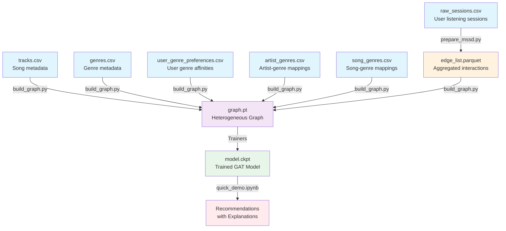

# Technical Architecture

## System Overview

The Spotify Engine is a graph-based recommendation system that transforms music listening sessions into a heterogeneous graph structure, applies Graph Attention Networks for learning, and provides explainable recommendations through attention visualization.

## Data Flow Pipeline



### Detailed Pipeline Steps

1. **Data Generation** (`generate_synthetic_data.py`)
   - Creates synthetic listening sessions with realistic patterns
   - Generates 35 music genres with Zipf-distributed popularity
   - Assigns genres to artists (1-3 genres per artist) and songs
   - Creates user genre preferences with affinity scores
   - Outputs: 
     - `raw_sessions.csv` - Listening sessions
     - `tracks.csv` - Song metadata
     - `genres.csv` - Genre definitions
     - `artist_genres.csv` - Artist-genre mappings
     - `song_genres.csv` - Song-genre mappings  
     - `user_genre_preferences.csv` - User genre affinities
   - 1000 users, 5000 songs, 500 artists, 35 genres
   - Raw Format:

     ```text
     user_id, track_id, artist_id, timestamp, ms_played, track_duration_ms
     ```

2. **ETL Processing** (`prepare_mssd.py`)

   ```text
   Input:  user_id | track_id | ms_played | timestamp
   Output: user_id | track_id | play_count | avg_completion | edge_weight
   ```

   - Aggregates multiple sessions per user-song pair
   - Calculates completion ratios
   - Creates edge weights

3. **Graph Construction** (`build_graph.py`)
   - Builds PyTorch Geometric HeteroData object with 4 node types
   - Creates node mappings and edge indices for all relationships
   - Processes genre nodes and genre-related edges
   - Normalizes edge weights including genre affinity scores
   - Handles missing nodes and relationships
   - Adds genre metadata to graph attributes

4. **Model Training** (Trainer Architecture)
   - **SimpleTrainer**: Basic training on all data
   - **AdvancedTrainer**: With validation, early stopping, LR scheduling
   - Uses BPR loss for implicit feedback learning
   - Outputs model checkpoints and metrics

5. **Inference** (`quick_demo.ipynb`)
   - Loads trained model
   - Generates recommendations with explanations
   - Visualizes attention weights

## Graph Structure

### Node Types

```text
┌─────────────┐     ┌─────────────┐     ┌─────────────┐     ┌─────────────┐
│   User      │     │   Song      │     │   Artist    │     │   Genre     │
├─────────────┤     ├─────────────┤     ├─────────────┤     ├─────────────┤
│ id: int     │     │ id: int     │     │ id: int     │     │ id: int     │
│ type: str   │     │ (no feat.)  │     │ name: str   │     │ name: str   │
└─────────────┘     └─────────────┘     └─────────────┘     │ popularity  │
       │                    │                    │           └─────────────┘
       │                    │                    │                    ▲
       └────listens─────────┘                    │                    │
              edge                               │                    │
         ├─ play_count                           │                    │
         ├─ completion_ratio                     │                    │
         └─ edge_weight                          │                    │
                                                 │                    │
       ┌────prefers──────────────────────────────┼────────────────────┘
       │      edge                               │        edge
       │ └─ affinity_score                       └───────belongs_to
       │                                                      │
       ▼                    ┌────────performs─────────────────┘
     Genre                  │         edge
                           ▼
                           │
                           └────────────► Song ──────has_genre──────► Genre
                                                      edge
```

### Edge Attributes

#### User → Song (listens_to)
- **play_count**: Number of times user played song
- **completion_ratio**: Average fraction of song listened
- **edge_weight**: 0.7 × completion_ratio + 0.3 × normalized_play_count

#### User → Genre (prefers)
- **affinity_score**: Normalized preference score (0-1) based on user type and listening history

#### Artist → Genre (belongs_to)
- No attributes (membership relationship)

#### Song → Genre (has_genre)
- No attributes (inherited from artist genres)

## Model Architecture

The system includes two model variants:

### 1. Basic GAT Recommender (Collaborative Filtering Only)

The basic model focuses on user-song interactions without genre information.

### 2. Enhanced GAT Recommender (Genre-Aware)

The enhanced model incorporates genre information for improved recommendations and explainability.

### GAT Recommender Components

```text
┌─────────────────────────────────────┐
│         Input Layer                 │
├─────────────────────────────────────┤
│ User Embeddings (1000 × 32)         │
│ Song Embeddings (5000 × 32)         │
│ Artist Embeddings (500 × 32)        │
│ Genre Embeddings (35 × 32)*         │
└──────────────┬──────────────────────┘
  (*Enhanced model only)
               │
┌──────────────▼──────────────────────┐
│      GAT Layers                     │
├─────────────────────────────────────┤
│ Basic Model:                        │
│ - Single GAT layer (4 heads)        │
│ - Dropout (0.1)                     │
│                                     │
│ Enhanced Model:                     │
│ - Layer 1: GAT (4 heads, 64 dims)   │
│ - Layer 2: GAT (2 heads, 32 dims)   │
│ - Batch normalization               │
│ - Dropout (0.2)                     │
│ - Genre-aware attention             │
│ - Preserves attention weights       │
└──────────────┬──────────────────────┘
               │
┌──────────────▼──────────────────────┐
│    Output Projection                │
├─────────────────────────────────────┤
│ Linear(32, 32) + ReLU               │
│ Skip connection from input          │
└──────────────┬──────────────────────┘
               │
┌──────────────▼──────────────────────┐
│      Scoring Function               │
├─────────────────────────────────────┤
│ Basic: score(u,s) = u·s             │
│                                     │
│ Enhanced:                           │
│ collab_score = u·s                  │
│ genre_score = genre_similarity(u,s) │
│ final = α·collab + (1-α)·genre      │
│ (α = 0.8 by default)                │
└─────────────────────────────────────┘
```

### Recommendation Method

The model includes a `recommend()` method that:

1. Computes embeddings for all nodes
2. For a target user, computes similarity scores with all songs
3. Returns top-k songs, their scores, and attention weights
4. Handles cold-start users through default embeddings

```python
def recommend(self, user_idx, x_dict, graph, k=10):
    """Generate recommendations for a specific user.
    
    Returns:
        top_k_songs: Tensor of song indices
        scores: Tensor of recommendation scores
        attention: (edge_index, attention_weights) tuple
    """
```

### Model Statistics

#### Basic Model
- **Total Parameters**: 206,688
- **Embedding Parameters**: 205,600 (99.5%)
- **GAT Parameters**: ~1,088
- **Model Size**: < 1MB

#### Enhanced Model  
- **Total Parameters**: ~500K+
- **Additional Genre Embeddings**: 1,120 (35 × 32)
- **Multi-layer GAT Parameters**: ~10K
- **Model Size**: < 2MB

## Training Architecture

Both trainer classes support training either the basic or enhanced model through configuration.

### Trainer Classes

```text
BaseTrainer (Abstract)
├── SimpleTrainer      # Quick experiments
└── AdvancedTrainer   # Production training
```

- **BaseTrainer**: Provides common functionality (checkpointing, metrics, training loop)
- **SimpleTrainer**: Trains on all data, fixed LR, basic metrics
- **AdvancedTrainer**: Train/val/test splits, early stopping, LR scheduling, comprehensive metrics

### Training Strategies

| Feature | SimpleTrainer | AdvancedTrainer |
|---------|--------------|------------------|
| Data Splits | None | 70/15/15 |
| Early Stopping | No | Yes |
| LR Scheduling | No | ReduceLROnPlateau |
| Checkpointing | Final only | Best + regular |
| Metrics | Loss, Recall@10 | + NDCG@10, validation |

## Training Process

### Loss Function: BPR (Bayesian Personalized Ranking)

```python
loss = -log(sigmoid(score(u, pos_item) - score(u, neg_item)))
```

### Training Loop

1. Sample batch of user-song edges
2. For each positive pair, sample negative song
3. Forward pass through GAT
4. Compute BPR loss
5. Backpropagate and update

### Optimization

- **Optimizer**: Adam (lr=0.01)
- **Batch Size**: 512
- **Epochs**: 10-20
- **Early Stopping**: When Recall@10 plateaus
- **Hyperparameter Selection**: Grid search on validation set

## Evaluation Metrics

### Primary Metrics

- **Recall@10**: Percentage of user's test items found in top-10 recommendations
- **NDCG@10**: Normalized Discounted Cumulative Gain for ranking quality
- **Loss**: BPR loss on validation set

### Genre-Aware Metrics (Enhanced Model)

- **Genre Diversity**: Variety of genres in recommendations
- **Genre Coverage**: Percentage of genres represented in recommendations
- **Genre Influence Score**: Quantifies impact of genre preferences on recommendations

### Extended Metrics

- **Coverage**: Percentage of items that can be recommended
- **Diversity**: Uniqueness of recommendations across users  
- **Novelty**: Ability to recommend less popular items
- **User Type Performance**: Metrics broken down by casual/regular/power users

## Explainability Mechanism

The enhanced model provides comprehensive explainability through multiple mechanisms:

### 1. Attention Weight Interpretation

The GAT attention mechanism computes weights α_ij indicating how much song j influences recommendations for user i:

```text
attention(i,j) = softmax(LeakyReLU(a^T[W·h_i || W·h_j]))
```

These weights are:

- **Normalized**: Sum to 1 across neighbors
- **Interpretable**: Higher weight = stronger influence
- **Visualizable**: Can create attention heatmaps

### 2. Genre-Based Explanations

The enhanced model explains recommendations through genre analysis:

```python
explanation = {
    'collaborative_score': 0.75,
    'genre_score': 0.82,
    'final_score': 0.77,
    'matched_genres': ['Rock', 'Alternative'],
    'genre_influence': 0.25
}
```

### 3. Multi-Factor Reasoning

```text
Recommending "Song X" because:

1. Similar Listening Patterns (75% influence):
   - Users who liked "Song A" also enjoyed this (attention: 0.45)
   - Similar to "Song B" in your history (attention: 0.31)
   
2. Genre Match (25% influence):
   - Matches your preference for Rock (affinity: 0.85)
   - Artist shares Alternative genre with your favorites
   
3. Popularity Context:
   - Moderately popular in your preferred genres
   - Discovered by users with similar tastes
```

## Error Handling

### Cold-Start Scenarios

- **New Users**: Fall back to popularity-based recommendations
- **New Songs**: Initialized with artist embedding + small random noise
- **Sparse Users**: Supplemented with similar user preferences

### Edge Cases

- **Disconnected Nodes**: Handled through graph preprocessing
- **Invalid Input**: Input validation in recommendation API
- **Empty Results**: Default recommendations as fallback

## System Requirements

### Computational

- **Memory**: ~500MB for graph + model
- **Training Time**: ~2-5 minutes (CPU)
- **Inference**: < 100ms per user

### Dependencies

- PyTorch >= 2.0
- PyTorch Geometric
- Python 3.8-3.12
- 2GB RAM minimum

## Implementation Status

### ✅ Completed Features

- **Genre System**: Full implementation with 35 genres
- **Enhanced GAT Model**: Multi-layer architecture with genre awareness
- **Comprehensive Explainability**: Attention + genre-based explanations
- **Extended Metrics**: Genre diversity, coverage, and influence analysis
- **Realistic Data Generation**: Beta distributions, user behavioral patterns
- **Data Validation**: Quality checks for behavioral patterns and distributions

### 🎯 Next Phase Features

- **Model Versioning**: Experiment tracking and comparison
- **Hyperparameter Optimization**: Automated tuning with Optuna
- **Context Features**: Time-of-day, activity-based recommendations
- **API Development**: REST endpoints for serving recommendations

## Future Architecture Considerations

### Scalability

- Graph sampling for larger datasets
- Distributed training with DGL
- Approximate nearest neighbor search
- Incremental learning for new users/songs

### Additional Features

- Temporal edges (time of listening)
- Content features (audio embeddings)
- Social edges (friend connections)
- Multi-task learning (predict skips, likes)
- Cross-domain recommendations

### Production Deployment

- Model serving with TorchServe
- Redis for embedding cache
- PostgreSQL for user data
- Kubernetes for orchestration
