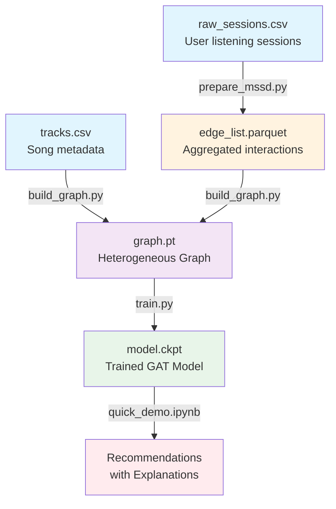

# Technical Architecture

## System Overview

The Spotify Engine is a graph-based recommendation system that transforms music listening sessions into a heterogeneous graph structure, applies Graph Attention Networks for learning, and provides explainable recommendations through attention visualization.

## Data Flow Pipeline



### Detailed Pipeline Steps

1. **Data Generation** (`generate_synthetic_data.py`)
   - Creates synthetic listening sessions with realistic patterns
   - Outputs: `raw_sessions.csv`, `tracks.csv`
   - 1000 users, 5000 songs, 500 artists
   - Raw Format:

     ```text
     user_id, track_id, artist_id, timestamp, ms_played, track_duration_ms
     ```

2. **ETL Processing** (`prepare_mssd.py`)

   ```text
   Input:  user_id | track_id | ms_played | timestamp
   Output: user_id | track_id | play_count | avg_completion | edge_weight
   ```

   - Aggregates multiple sessions per user-song pair
   - Calculates completion ratios
   - Creates edge weights

3. **Graph Construction** (`build_graph.py`)
   - Builds PyTorch Geometric HeteroData object
   - Creates node mappings and edge indices
   - Normalizes edge weights
   - Handles missing nodes and relationships

4. **Model Training** (`train.py`)
   - Trains GAT with BPR loss
   - Outputs model checkpoint and metrics
   - Implements early stopping based on Recall@10

5. **Inference** (`quick_demo.ipynb`)
   - Loads trained model
   - Generates recommendations with explanations
   - Visualizes attention weights

## Graph Structure

### Node Types

```text
┌─────────────┐     ┌─────────────┐     ┌─────────────┐
│   User      │     │   Song      │     │   Artist    │
├─────────────┤     ├─────────────┤     ├─────────────┤
│ id: int     │     │ id: int     │     │ id: int     │
│ (no feat.)  │     │ (no feat.)  │     │ name: str   │
└─────────────┘     └─────────────┘     └─────────────┘
       │                    │                    │
       │                    │                    │
       └────listens─────────┘                    │
              edge                               │
         ├─ play_count                           │
         ├─ completion_ratio                     │
         └─ edge_weight                          │
                                                 │
                    ┌────────performs────────────┘
                    │         edge
                    ▼
                    │
                    └────────────► Song
```

### Edge Attributes

- **play_count**: Number of times user played song
- **completion_ratio**: Average fraction of song listened
- **edge_weight**: 0.7 × completion_ratio + 0.3 × normalized_play_count

## Model Architecture

### GAT Recommender Components

```text
┌─────────────────────────────────────┐
│         Input Layer                 │
├─────────────────────────────────────┤
│ User Embeddings (1000 × 32)         │
│ Song Embeddings (5000 × 32)         │
│ Artist Embeddings (500 × 32)        │
└──────────────┬──────────────────────┘
               │
┌──────────────▼──────────────────────┐
│      GAT Layer (4 heads)            │
├─────────────────────────────────────┤
│ - Multi-head attention              │
│ - Dropout (0.1)                     │
│ - Output: 32 dims                   │
│ - Preserves attention weights       │
└──────────────┬──────────────────────┘
               │
┌──────────────▼──────────────────────┐
│    Output Projection                │
├─────────────────────────────────────┤
│ Linear(32, 32) + ReLU               │
│ Skip connection from input          │
└──────────────┬──────────────────────┘
               │
┌──────────────▼──────────────────────┐
│      Scoring Function               │
├─────────────────────────────────────┤
│ score(u,s) = u·s (dot product)      │
└─────────────────────────────────────┘
```

### Recommendation Method

The model includes a `recommend()` method that:

1. Computes embeddings for all nodes
2. For a target user, computes similarity scores with all songs
3. Returns top-k songs, their scores, and attention weights
4. Handles cold-start users through default embeddings

```python
def recommend(self, user_idx, x_dict, graph, k=10):
    """Generate recommendations for a specific user.
    
    Returns:
        top_k_songs: Tensor of song indices
        scores: Tensor of recommendation scores
        attention: (edge_index, attention_weights) tuple
    """
```

### Model Statistics

- **Total Parameters**: 206,688
- **Embedding Parameters**: 205,600 (99.5%)
- **GAT Parameters**: ~1,088
- **Lightweight**: Fits in < 1MB

## Training Process

### Loss Function: BPR (Bayesian Personalized Ranking)

```python
loss = -log(sigmoid(score(u, pos_item) - score(u, neg_item)))
```

### Training Loop

1. Sample batch of user-song edges
2. For each positive pair, sample negative song
3. Forward pass through GAT
4. Compute BPR loss
5. Backpropagate and update

### Optimization

- **Optimizer**: Adam (lr=0.01)
- **Batch Size**: 512
- **Epochs**: 10-20
- **Early Stopping**: When Recall@10 plateaus
- **Hyperparameter Selection**: Grid search on validation set

## Evaluation Metrics

### Primary Metrics

- **Recall@10**: Percentage of user's test items found in top-10 recommendations
- **Loss**: BPR loss on validation set

### Secondary Metrics

- **Coverage**: Percentage of items that can be recommended
- **Diversity**: Uniqueness of recommendations across users
- **Novelty**: Ability to recommend less popular items

## Explainability Mechanism

### Attention Weight Interpretation

The GAT attention mechanism computes weights α_ij indicating how much song j influences recommendations for user i:

```text
attention(i,j) = softmax(LeakyReLU(a^T[W·h_i || W·h_j]))
```

These weights are:

- **Normalized**: Sum to 1 across neighbors
- **Interpretable**: Higher weight = stronger influence
- **Visualizable**: Can create attention heatmaps

### Example Explanation

```text
Recommending "Song X" because you listened to:
- "Song A" (attention: 0.45) - same artist
- "Song B" (attention: 0.31) - similar style  
- "Song C" (attention: 0.24) - genre match
```

## Error Handling

### Cold-Start Scenarios

- **New Users**: Fall back to popularity-based recommendations
- **New Songs**: Initialized with artist embedding + small random noise
- **Sparse Users**: Supplemented with similar user preferences

### Edge Cases

- **Disconnected Nodes**: Handled through graph preprocessing
- **Invalid Input**: Input validation in recommendation API
- **Empty Results**: Default recommendations as fallback

## System Requirements

### Computational

- **Memory**: ~500MB for graph + model
- **Training Time**: ~2-5 minutes (CPU)
- **Inference**: < 100ms per user

### Dependencies

- PyTorch >= 2.0
- PyTorch Geometric
- Python 3.8-3.12
- 2GB RAM minimum

## Future Architecture Considerations

### Scalability

- Graph sampling for larger datasets
- Distributed training with DGL
- Approximate nearest neighbor search

### Additional Features

- Temporal edges (time of listening)
- Content features (audio embeddings)
- Social edges (friend connections)
- Multi-task learning (predict skips, likes)

### Production Deployment

- Model serving with TorchServe
- Redis for embedding cache
- PostgreSQL for user data
- Kubernetes for orchestration
